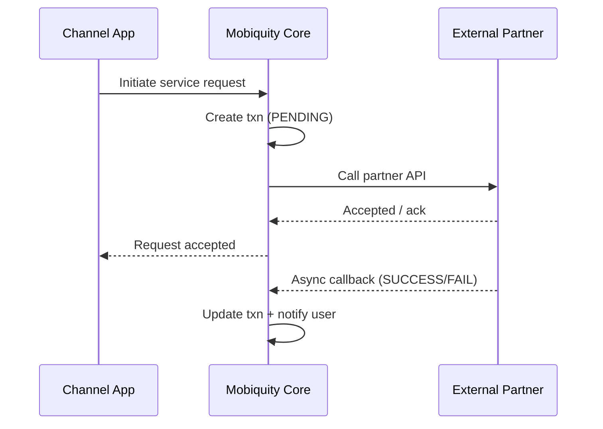

# Sequence Diagram Pattern — Third-party Integration Callback

## Purpose
Style for aggregator / biller / bank integrations with async callbacks.

## Example Mermaid

## Notes for authors
- Always show PENDING → final state.
- Include idempotent callback handling in the FSD text near the diagram.
