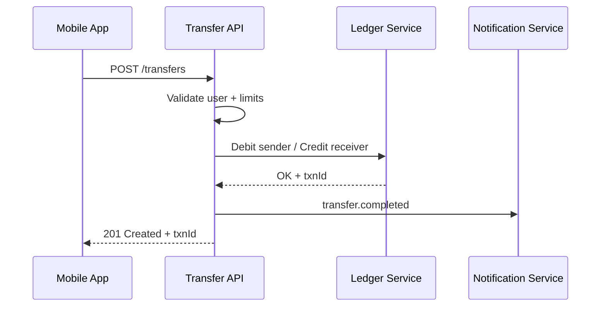
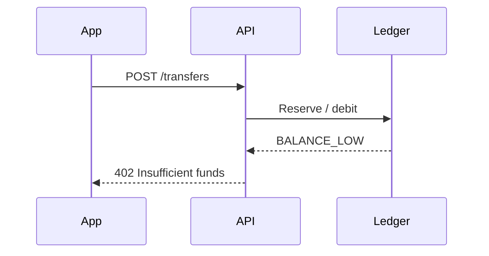

# Sequence Diagram Pattern — Wallet / Payment API

## Purpose
Standard Mermaid sequence style for payment / transfer style FSDs.

## Example Mermaid

```mermaid
sequenceDiagram
  participant App as Mobile App
  participant API as Transfer API
  participant Ledger as Ledger Service
  participant Notify as Notification Service

  App->>API: POST /transfers
  API->>API: Validate user + limits
  API->>Ledger: Debit sender / Credit receiver
  Ledger-->>API: OK + txnId
  API->>Notify: transfer.completed
  API-->>App: 201 Created + txnId
```

## Alt failure (insufficient funds)

```mermaid
sequenceDiagram
  participant App
  participant API
  participant Ledger
  App->>API: POST /transfers
  API->>Ledger: Reserve / debit
  Ledger-->>API: BALANCE_LOW
  API-->>App: 402 Insufficient funds
```
