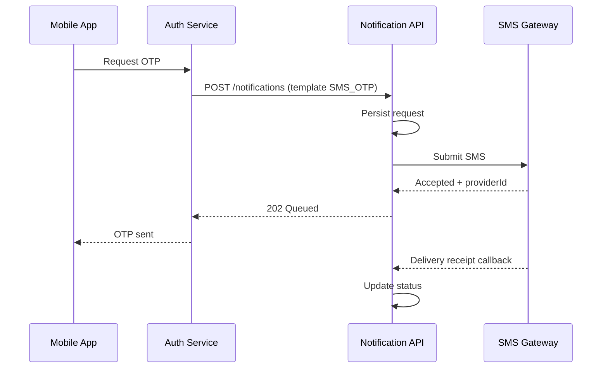

# Sequence Diagram Pattern — External Notification / SMS

## Purpose
Teach the FSD generator how we draw **web sequence diagrams** for notification flows
(SMS, email, push) using Mermaid `sequenceDiagram`.

## When to use
- OTP SMS
- Delivery callbacks from an SMS gateway
- Store-and-forward notification API

## Example Mermaid (copy this style)

## Writing rules
- Name participants clearly (App, API, Gateway).
- Show happy path first; add failure/retry as notes or alt blocks if needed.
- Keep one diagram focused on one flow.
